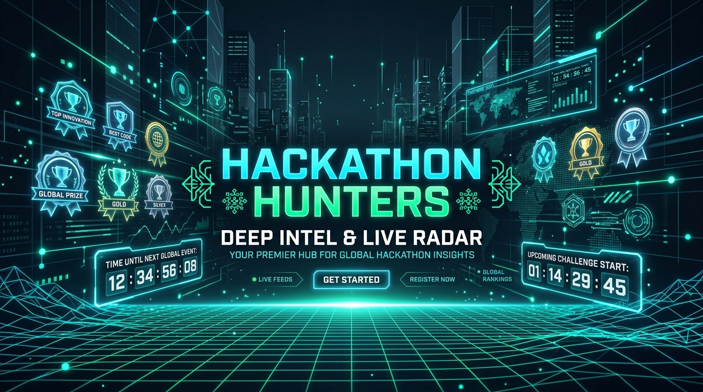
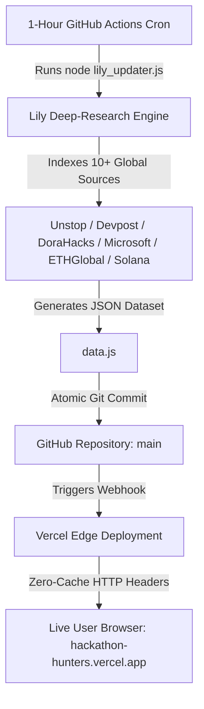

# 📡 Hackathon Hunters — Global Deep-Research Radar

<div align="center">



[](https://hackathon-hunters.vercel.app)
[-10b981?style=for-the-badge&logo=github-actions)](https://github.com/ByteBySway/hackathon-hunters/actions)
[](LICENSE)

**Unbiased, Automated Deep-Research Intelligence for Hackers & Builders Across 10+ Global Platforms**

[🌐 View Live Radar](https://hackathon-hunters.vercel.app) • [📋 My Hunt Board](https://hackathon-hunters.vercel.app) • [📄 Export PDF Dossiers](https://hackathon-hunters.vercel.app)

</div>

---

## ⚡ Core Features

- 🌐 **Multi-Platform Intelligence**: Deep-researches hackathons across **Unstop**, **Devpost**, **Devfolio**, **Microsoft Imagine Cup**, **DoraHacks**, **Lablab.ai**, **ETHGlobal**, **Solana Foundation**, **Kaggle**, and **MLH**.
- ⏰ **100% Automated 1-Hour Cloud Schedule**: GitHub Actions autonomously runs the research engine every 1 hour, updates the dataset, and triggers instant Vercel re-deployments.
- 🎯 **Deep Intel Dossiers**: Comprehensive breakdown of eligibility, problem statements, track prizes, judge focus areas, compliance rules, and winning playbooks.
- 📄 **1-Click PDF Dossier Exporter**: Download executive-grade PDF reports with smart page-break protection and 2-column summaries.
- ⏱️ **Ticking Countdown Timers**: Live countdowns calculating submission deadlines down to the second.
- 📋 **Personal Kanban Hunt Board**: Track events from Bookmarked to Applied, Building, Submitted, and Won.
- 🚀 **Zero-Cache CDN Engine**: Vercel Edge rules ensure your browser always fetches the absolute latest live dataset.

---

## 🏗️ Architecture Overview



---

## 📂 Project Structure

```text
hackathon-hunters/
├── index.html                   # Master Responsive Single-Page Application
├── styles.css                   # Glassmorphism & Custom Tailwind Theme Styles
├── app.js                       # Client-Side Application Engine & PDF Exporter
├── data.js                      # Live Multi-Source Hackathon Dataset
├── lily_updater.js              # Multi-Source Deep-Research Aggregator Script
├── package.json                 # Project Metadata & Scripts
├── vercel.json                  # Vercel Zero-Cache HTTP Header Rules
├── .github/
│   └── workflows/
│       └── lily_auto_update.yml # 1-Hour Automated GitHub Actions Cloud Pipeline
└── assets/
    ├── logo.jpg                 # Brand Logo
    └── banner.jpg               # Hero Banner Image
```

---

## 🚀 Local Development

```bash
# Clone the repository
git clone https://github.com/ByteBySway/hackathon-hunters.git

# Navigate to project directory
cd hackathon-hunters

# Run deep-research updater locally
node lily_updater.js
```

---

## 📜 License

Distributed under the MIT License. See `LICENSE` for more information.
